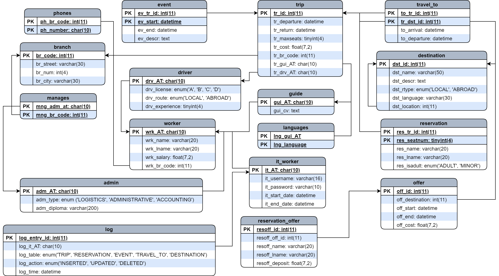
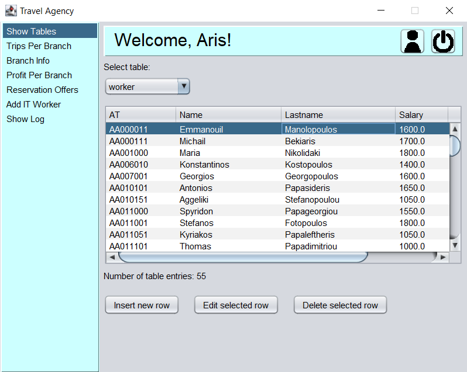

# CEID-DATA-BASES-PROJECT-2022

This project was made for the **5th semester** undergraduate course "Databases" of the **Computer Engineering & Informatics Department (CEID), University of Patras**.

The project is split into two parts:
- **Database design**, including the corresponding SQL scripts for table creation, data insertion, stored procedures and triggers 
- A **graphical application in Java** for managing the database through a set of relevant operations

# Database
The database is a miniature model of a travel agency, described as follows:
- The agency has a series of **branches**
- Each branch can organize one or more **trips** to one or more **destinations**, local or abroad. At each destination, one or more **events** may be taking place.
- The agency can put out **offers** for specific destinations, which are used by the agency to plan future trips. Customers **can reserve offers**.
- Customers can **reserve** seats for specific trips, as long as the maximum capacity isn't exceeded
- Each branch has multiple **workers**. A worker can be one of the following:
    - **Admin**: An administrative employee, who belongs to either logistics or accounting, or servers as the branch **manager** (one per branch)
    - **Driver**: Transports tourists to each trip's destination using the agency's vehicles
    - **Guide**: Leads and accompanies tourists on each trip, providing information about the destination. May speak multiple languages.
    - **IT**: Database managers, who log into the application and perform various actions. The worker's actions are **logged**


The resulting relational diagram is seen below:
<p align="center">
  
</p>


Records are provided for all the tables. 

# Graphical User Interface (GUI)
The database is accompanied by a graphical application straight out of 2004 🔥🔥

<p align="center">
  
</p>

### Features:

- Insert, edit and delete data from all tables. Each table has its own editing panel, taking the various field types into account. Also, discrete fields (e.g. dropdowns) are automatically populated by pulling only the relevant data from the database
- List information for all scheduled trips of a specific branch, in a given time period
- List information for each branch, including the manager, income, expenses and all its workers, along with their information
- List customers who reserved an offer
- Transfer workers or assign new ones to the IT position
- Read and empty the action log

### 💣Important Notice
In this project, emphasis was placed on the database (schema, procedures, constraints) and the manipulation of data through the GUI. For this purpose, we assume an environment with only one client (despite the fact that many users can log in),
thus communication between the GUI and the database happens directly, without a proper backend. This decision unfortunately led to some hacky solutions, such as storing the current user into an SQL table with only one field. A more appropriate implementation of the whole system would involve an intermediate server that would handle authentication, keep track of sessions and forward requests to the database, but this was deemed out of scope for this project.

# How to Run
You can build the project with the IDE of your choice. Gradle files are provided for convenience and  reproducibility, allowing you to build and run the project entirely from the terminal, too.

First, clone this repository and enter the directory:
```
git clone git@github.com:PKalozoumis/CEID-DATA-BASES-PROJECT-2022.git

cd CEID-DATA-BASES-PROJECT-2022
```

To create and populate the database, enter the directory with the SQL scripts:
```
cd sql/source
```

Make sure you have access to your ```mysql``` server. Then, connect to the server and source the main script. This will automatically create the database, with all the tables and records:
```
SOURCE main.sql
```
While in the server, create a new user who will be used by the application "backend" to connect the database. This step is optional, as you can use an already existing user. The following ```mysql``` command will create a user named ```db_project_2022_user``` with an empty password:
```mysql
CREATE USER 'db_project_2022_user'@'localhost' IDENTIFIED BY '';
```
Grant the user permissions to the new database:
```
GRANT ALL PRIVILEGES ON db_project_2022.* TO USER 'db_project_2022_user'@'localhost' WITH GRANT OPTION;

FLUSH PRIVILEGES;
```

Exit the server. Back in the base directory, create a copy of or rename the ```.env.template``` file into a new file named ```.env```. Edit it with your database credentials:
```
DB_USER = db_project_2022_user
DB_PASS =
DB_HOST = localhost
DB_PORT = 3306
DB_NAME = db_project_2022
```
## Build and Run
From the base directory, enter the ```gui``` directory.
```
cd gui
```

### Installing Java
To build the application, Java is required. To check if Java is installed, run the following:
```
java -version
```
You should see something like the following:
```
openjdk version "17.0.17" 2025-10-21
OpenJDK Runtime Environment Temurin-17.0.17+10 (build 17.0.17+10)
OpenJDK 64-Bit Server VM Temurin-17.0.17+10 (build 17.0.17+10, mixed mode, sharing)
```

If it's not installed and you're on Windows, download Java from either one of these links:
- [Oracle JDK](https://www.oracle.com/java/technologies/javase-jdk17-downloads.html)
- [Adoptium OpenJDK](https://adoptium.net/)

On Debian-based distributions (e.g. Ubuntu), run the following:
```
# Update package lists
sudo apt update

# Install OpenJDK 21 (any version can work)
sudo apt install openjdk-21-jdk
```

In both cases, verify the installation with ```java --version```


### Running the app
In the ```gui``` directory, you need to build the application with gradle. Just run the following:
```
./gradlew build
```

Once the building is complete, run the app with:
```
./gradlew run
```

In the login screen, choose any one of the IT workers to log-in as. Here are some examples:
<table>
  <tr>
    <th>Username</th>
    <th>Password</th>
  </tr>
  <tr><td>damien</td><td>password</td></tr>
  <tr><td>aris</td><td>1821</td></tr>
  <tr><td>pasxalis</td><td>123456</td></tr>
  <tr><td>kardatos</td><td>password</td></tr>
  <tr><td>stelios</td><td>123456789</td></tr>
  <tr><td>leo</td><td>qwerty</td></tr>
</table>


## Populating the reservation_offer table (optional)
The ```reservaton_offer``` table is filled with 60k records of reservations made by random customers for one  of the 3 offers in the test scenario. The names of these customers are composed by shuffling first and last names from the external file ```reservation_offer/names.txt```. For this purpose, a Python script is used.

To use the script, first install the required dependencies:
```
pip install mysql-connector-python

pip install python-dotenv
```

From the base directory, follow the path to the script and execute it:
```
cd reservation_offer

python reservation_offer.py
```

The table should now be populated.